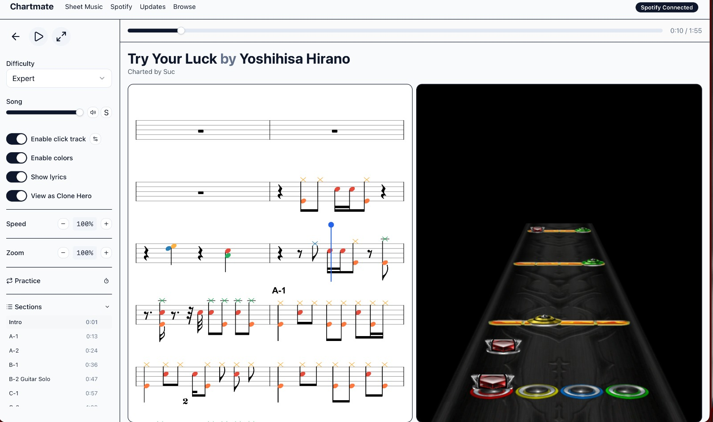

# Chartmate

A desktop companion app for **Clone Hero** and **YARG** players. Browse, manage, and preview custom charts — all from one place.


<p align="center">
  
</p>

## Features

### Browse & Download Charts
Search the [Encore](https://enchor.us) catalog with filters for instrument, difficulty, and drum type. Download charts directly into your songs folder.

### Drum Sheet Music Viewer
View any chart rendered as drum sheet music with synchronized audio playback. Adjust speed, toggle individual audio tracks, and switch between difficulty levels.

### Spotify Library Scanner
Connect your Spotify account to find charts for songs you already listen to. Scans your playlists and matches them against the Encore database.

### Chart Updater
Compares your local chart library against Encore to find newer versions of charts you already have installed.

## Getting Started

### Prerequisites

- [Rust](https://rustup.rs/) (stable)
- [Node.js](https://nodejs.org/) (v18+)
- [pnpm](https://pnpm.io/)
- A [Clone Hero](https://clonehero.net/) or [YARG](https://yarg.in/) songs folder

### Installation

```bash
git clone https://github.com/your-username/chartmate.git
cd chartmate
pnpm install
```

### Development

```bash
pnpm tauri dev
```

### Build

```bash
pnpm tauri build
```

The built app will be in `src-tauri/target/release/bundle/`.

## Tech Stack

| Layer | Technology |
|-------|-----------|
| Desktop framework | [Tauri v2](https://v2.tauri.app/) |
| Frontend | React 19, TypeScript, Tailwind CSS v4 |
| Backend | Rust |
| Database | SQLite (via Kysely) |
| Chart rendering | Three.js, VexFlow |
| Audio | Web Audio API |
| Chart parsing | [@eliwhite/scan-chart](https://www.npmjs.com/package/@eliwhite/scan-chart) |

## Project Structure

```
chartmate/
├── src/                    # React frontend
│   ├── components/         # Reusable UI components
│   ├── pages/              # Route pages
│   ├── lib/                # Core logic (DB, audio, search, etc.)
│   └── contexts/           # React contexts
├── src-tauri/              # Rust backend
│   ├── src/                # Tauri commands and plugins
│   └── capabilities/       # Permission definitions
└── public/                 # Static assets
```

## First Launch

On first launch, Chartmate will ask you to select your Clone Hero / YARG songs folder. This is used for:

- Scanning your local chart library
- Downloading new charts
- Checking for chart updates

## Spotify Integration

Chartmate uses Spotify's Web API to read your playlists. To connect:

1. Click **Connect Spotify** in the top navigation
2. Authorize via the browser popup
3. Your playlists will be scanned for matching charts

Authentication uses the `chartmate://` deep-link protocol for the OAuth callback.

## Contributing

Contributions are welcome! Please open an issue first to discuss what you'd like to change.

1. Fork the repository
2. Create your feature branch (`git checkout -b feat/my-feature`)
3. Commit your changes
4. Push to the branch (`git push origin feat/my-feature`)
5. Open a Pull Request

## License

[MIT](LICENSE)
